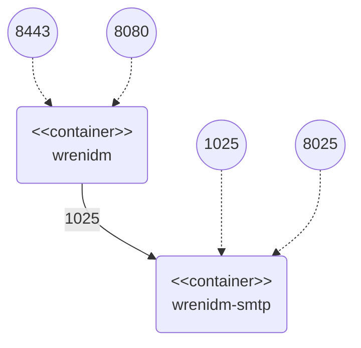

# Email Notification Sample

This sample demonstrates sending of email notifications through Wren:IDM.


## Configuration Files

Configuration files used in this sample can be found in `conf` folder:

  * `external.email.json` – configuration of SMTP server

Those files are mounted into the Wren:IDM container as bind mounts.
If you change them, Wren:IDM will notice and handle the change without restart.


## Docker Containers

The sample works with the following docker containers:

  * wrenidm – container with Wren:IDM installation
  * wrenidm-smtp – testing SMTP server



All needed Docker containers can be started through following commands:

```bash
cd {GIT_REPOSITORIES}/wrenidm-cookbook/email
docker-compose up -d
```


## Sample Procedure


### 1. Send Email Notification

Send email notification through default Wren:IDM email endpoint using:

```bash
curl -k \
  -u openidm-admin:openidm-admin \
  -H "Content-Type: application/json" \
  -XPOST \
  -d '{
    "from":"idm@wrensecurity.org",
    "to":"foobar@example.com",
    "type":"text/plain",
    "subject":"Hello World",
    "body":"Email notification sent from Wren:IDM."
  }' \
  "https://localhost:8443/openidm/external/email?_action=send"
```


### 2. Check Sent Email

1. Go to MailHog user interface: `http://localhost:8025/`

2. Check received email with subject *Hello World*


## Cleanup

When you finish all your tests, remove Docker containers using `docker-compose stop && docker-compose rm -f`.
