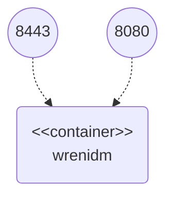

# Custom Endpoint Sample

This sample demonstrates creation of REST API endpoint to execute custom business logic.
Sample contains greeting endpoint handling HTTP GET and HTTP POST requests.


## Configuration Files

Configuration files used in this sample can be found in `conf` folder:

  * `endpoint-greeting.json` – greeting endpoint configuration (e.g. endpoint URL pattern)

Scripts used in this sample can be found in `script` folder:

  * `handle-greeting.js` – greeting endpoint handler

Those files are mounted into the Wren:IDM container as bind mounts.
If you change them, Wren:IDM will notice and handle the change without restart.


## Docker Containers

The sample works with single docker container:

  * wrenidm – container with Wren:IDM installation



Docker container can be started through following commands:

```bash
cd {GIT_REPOSITORIES}/wrenidm-cookbook/endpoint
docker-compose up -d
```


## Sample Procedure

### 1. Get Endpoint Data

Send HTTP GET request to the greeting endpoint using:

```bash
curl -k \
  -u openidm-admin:openidm-admin \
  "https://localhost:8443/openidm/endpoint/greeting"
```

You will receive HTTP 200 response with 'Hello, World!' greeting.


### 2. Send Data to the Endpoint

Send HTTP POST request with the custom data to the greeting endpoint using:

```bash
curl -k \
  -u openidm-admin:openidm-admin \
  -H "Content-Type: application/json" \
  -XPOST \
  -d '{"value":"Universe"}' \
  "https://localhost:8443/openidm/endpoint/greeting"
```

You will receive HTTP 200 response with 'Hello, Universe!' greeting.


## Cleanup

When you finish all your tests, remove Docker containers using `docker-compose stop && docker-compose rm -f`.
