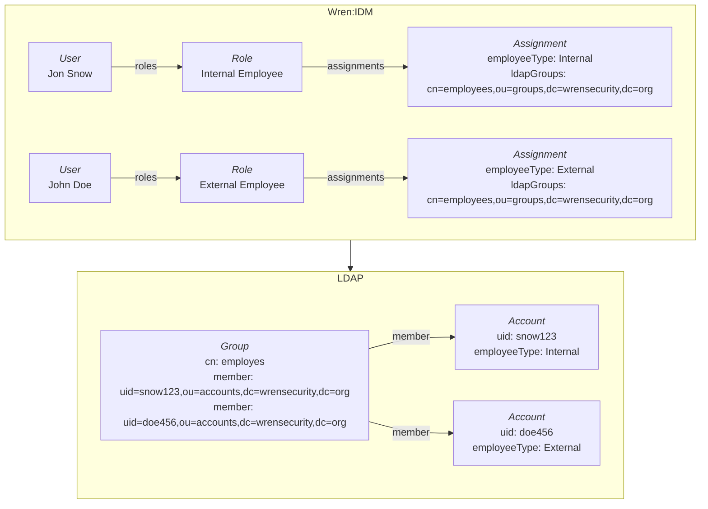
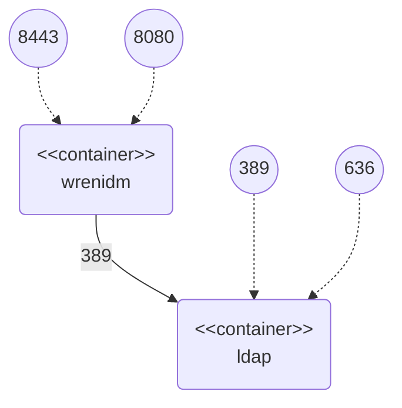

# Roles Sample

Firstly, this sample demonstrates management of Wren:IDM roles and role memberships.
Secondly, the sample demonstrates provisioning of user attributes based on assigned roles.




## Configuration Files

Configuration files used in this sample can be found in `conf` folder:

  * `provisioner.openicf-ldap.json` – configuration of LDAP connector
  * `sync.json` – mapping configuration:
    * `managedUser_ldapAccount` – mapping between Wren:IDM and LDAP

Those files are mounted into the Wren:IDM container as bind mounts.
If you change them, Wren:IDM will notice and handle the change without restart.


## Docker Containers

The sample works with the following docker containers:

  * wrenidm – container with Wren:IDM installation
  * ldap – container with OpenLDAP system



All needed Docker containers can be started through following commands:

```bash
cd {GIT_REPOSITORIES}/wrenidm-cookbook/roles
docker-compose up -d
```


## Sample Procedure


### 1. Create Roles and Assignments

Create role for internal employees using:

```bash
curl -k \
  -u openidm-admin:openidm-admin \
  -H "Content-Type: application/json" \
  -XPOST \
  -d '{
    "_id":"internal-employee",
    "name":"Internal Employee",
    "description":"Role for internal employees."
  }' \
  "https://localhost:8443/openidm/managed/role?_action=create"
```

Create role for external employees using:

```bash
curl -k \
  -u openidm-admin:openidm-admin \
  -H "Content-Type: application/json" \
  -XPOST \
  -d '{
    "_id":"external-employee",
    "name":"External Employee",
    "description":"Role for external employees."
  }' \
  "https://localhost:8443/openidm/managed/role?_action=create"
```

Now we will create assignments for LDAP attributes provisioning.
The following assignments will be created:

  * internal-employee
    * Sets value `Internal` to LDAP attribute `employeeType`
    * Assigns LDAP group `cn=employees,ou=groups,dc=wrensecurity,dc=org`
  * external-employee
    * Sets value `External` to LDAP attribute `employeeType`
    * Assigns LDAP group `cn=employees,ou=groups,dc=wrensecurity,dc=org`

Create assignment for internal employees using:

```bash
curl -k \
  -u openidm-admin:openidm-admin \
  -H "Content-Type: application/json" \
  -XPOST \
  -d '{
    "_id":"internal-employee",
    "name":"Internal Employee",
    "description":"LDAP attribute provisioning for internal employees.",
    "mapping":"managedUser_ldapAccount",
    "attributes":[
      {
        "name":"employeeType",
        "value":"Internal",
        "assignmentOperation":"mergeWithTarget",
        "unassignmentOperation":"removeFromTarget"
      },
      {
        "name":"ldapGroups",
        "value":[
            "cn=employees,ou=groups,dc=wrensecurity,dc=org"
        ],
        "assignmentOperation":"mergeWithTarget",
        "unassignmentOperation":"removeFromTarget"
      }
    ]
  }' \
  "https://localhost:8443/openidm/managed/assignment?_action=create"
```

Create assignment for external employees using:

```bash
curl -k \
  -u openidm-admin:openidm-admin \
  -H "Content-Type: application/json" \
  -XPOST \
  -d '{
    "_id":"external-employee",
    "name":"External Employee",
    "description":"LDAP attribute provisioning for external employees.",
    "mapping":"managedUser_ldapAccount",
    "attributes":[
      {
        "name":"employeeType",
        "value":"External",
        "assignmentOperation":"mergeWithTarget",
        "unassignmentOperation":"removeFromTarget"
      },
      {
        "name":"ldapGroups",
        "value":[
            "cn=employees,ou=groups,dc=wrensecurity,dc=org"
        ],
        "assignmentOperation":"mergeWithTarget",
        "unassignmentOperation":"removeFromTarget"
      }
    ]
  }' \
  "https://localhost:8443/openidm/managed/assignment?_action=create"
```

Create relations between roles and assignments using:

```bash
curl -k \
  -u openidm-admin:openidm-admin \
  -H "Content-Type: application/json" \
  -XPATCH \
  -d '[{
    "operation":"add",
    "field":"/assignments/-",
    "value":{ "_ref":"managed/assignment/internal-employee" }
  }]' \
  "https://localhost:8443/openidm/managed/role/internal-employee"
```

```bash
curl -k \
  -u openidm-admin:openidm-admin \
  -H "Content-Type: application/json" \
  -XPATCH \
  -d '[{
    "operation":"add",
    "field":"/assignments/-",
    "value":{ "_ref":"managed/assignment/external-employee" }
  }]' \
  "https://localhost:8443/openidm/managed/role/external-employee"
```


### 2. Create Users

Create managed users *Jon Snow (Internal Employee)* and *John Doe (External Employee)* using:

```bash
curl -k \
  -u openidm-admin:openidm-admin \
  -H "Content-Type: application/json" \
  -XPOST \
  -d '{
    "_id":"snow123",
    "userName":"snow123",
    "givenName":"Jon",
    "sn":"Snow",
    "mail":"jon.snow@example.com",
    "password":"FooBar123"
  }' \
  "https://localhost:8443/openidm/managed/user?_action=create"
```

```bash
curl -k \
  -u openidm-admin:openidm-admin \
  -H "Content-Type: application/json" \
  -XPOST \
  -d '{
    "_id":"doe456",
    "userName":"doe456",
    "givenName":"John",
    "sn":"Doe",
    "mail":"john.doe@example.com",
    "password":"FooBar123"
  }' \
  "https://localhost:8443/openidm/managed/user?_action=create"
```


### 3. Check Managed Objects

1. Go to admin user interface: `https://localhost:8443/admin`

2. Perform login using _openidm-admin_ as username and password

3. Navigate to role management: Manage -> Role

4. Check managed roles created in the Wren:IDM

5. Navigate to assignment management: Manage -> Assignment

6. Check managed assignments created in the Wren:IDM

7. Navigate to user management: Manage -> User

8. Check managed users created in the Wren:IDM


### 4. Check LDAP Accounts

The sample configuration has enabled implicit synchronization for LDAP account mapping.
This means that changes are propagated as soon as they happen in Wren:IDM without the need to trigger manual reconciliation.

1. List existing LDAP accounts:

    ```bash
    docker exec ldap ldapsearch -H ldap://localhost -x -D "cn=admin,dc=wrensecurity,dc=org" -w admin -b "ou=accounts,dc=wrensecurity,dc=org" "(objectClass=inetOrgPerson)"
    ```

2. List existing LDAP groups:

    ```bash
    docker exec ldap ldapsearch -H ldap://localhost -x -D "cn=admin,dc=wrensecurity,dc=org" -w admin -b "ou=groups,dc=wrensecurity,dc=org" "(objectClass=groupOfNames)"
    ```

First command returns LDAP accounts for previously created users.
LDAP attribute `employeeType` is not present.

Second command returns LDAP group with dummy member (member attribute is mandatory).


### 5. Assign Roles to Managed Users

Assign role *internal-employee* to user *Jon Snow* using:

```bash
curl -k \
  -u openidm-admin:openidm-admin \
  -H "Content-Type: application/json" \
  -XPATCH \
  -d '[{
    "operation":"add",
    "field":"/roles/-",
    "value":{ "_ref":"managed/role/internal-employee" }
  }]' \
  "https://localhost:8443/openidm/managed/user/snow123"
```

Assign role *external-employee* to user *John Doe* using:

```bash
curl -k \
  -u openidm-admin:openidm-admin \
  -H "Content-Type: application/json" \
  -XPATCH \
  -d '[{
    "operation":"add",
    "field":"/roles/-",
    "value":{ "_ref":"managed/role/external-employee" }
  }]' \
  "https://localhost:8443/openidm/managed/user/doe456"
```


### 5. Check Managed Users

List managed users using:

```bash
curl -k \
  -u openidm-admin:openidm-admin \
  "https://localhost:8443/openidm/managed/user?_queryFilter=true&_prettyPrint=true"
```

Check assigned roles (attribute `effectiveRoles`) and assignments (attribute `effectiveAssignments`).


### 6. Check LDAP Accounts

1. List existing LDAP accounts:

    ```bash
    docker exec ldap ldapsearch -H ldap://localhost -x -D "cn=admin,dc=wrensecurity,dc=org" -w admin -b "ou=accounts,dc=wrensecurity,dc=org" "(objectClass=inetOrgPerson)"
    ```

Both accounts have set correct value for attribute `employeeType`.

2. List existing LDAP groups:

    ```bash
    docker exec ldap ldapsearch -H ldap://localhost -x -D "cn=admin,dc=wrensecurity,dc=org" -w admin -b "ou=groups,dc=wrensecurity,dc=org" "(objectClass=groupOfNames)"
    ```

Both accounts are members of *employees* group.


## Cleanup

When you finish all your tests, remove Docker containers using `docker-compose stop && docker-compose rm -f`.
