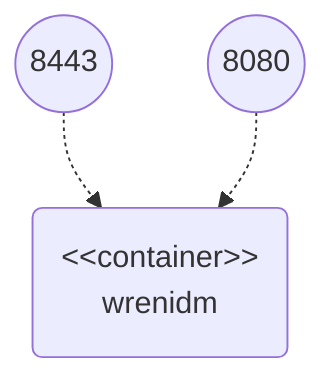

# Scheduling Sample

This sample demonstrates two actions that are automatically triggered each 15 seconds:

  * Synchronization of employees from the source system (CSV file)
  * Script printing greeting message


## Configuration Files

Configuration files used in this sample can be found in `conf` folder:

  * `provisioner.openicf-csv.json` – configuration of CSV file connector
  * `sync.json` – mapping configuration:
    * `csvEmployee_managedUser` – mapping between CSV file and Wren:IDM
  * `schedule-greeting.json` – configuration of scheduler for greeting script
  * `schedule-recon.json` – configuration of scheduler for CSV file reconciliation


Scripts used in this sample can be found in `script` folder:

  * `greeting.js` – script printing greeting message

Those files are mounted into the Wren:IDM container as bind mounts.
If you change them, Wren:IDM will notice and handle the change without restart.


## Docker Containers

The sample works with single docker container:

  * wrenidm – container with Wren:IDM installation



Docker container can be started through following commands:

```bash
cd {GIT_REPOSITORIES}/wrenidm-cookbook/scheduler
docker-compose up
```


## Sample Procedure


### 1. Check Greeting Messages

Check greeting messages in standard output of Wren:IDM docker container.
Greeting message is printed each 15 seconds.
Example output:

```bash
wrenidm    | OpenIDM version "6.0.2" (revision: aeb2e53) master
wrenidm    | Timestamp: "2022-06-01T11:27:15.026Z" – Hi, this is automatically triggered script!
wrenidm    | Timestamp: "2022-06-01T11:27:30.008Z" – Hi, this is automatically triggered script!
wrenidm    | Timestamp: "2022-06-01T11:27:45.002Z" – Hi, this is automatically triggered script!
...
```


### 2. Source System Reconciliation

1. Wait 15 seconds after Docker container startup

2. Go to admin user interface: `https://localhost:8443/admin`

3. Perform login using _openidm-admin_ as username and password

4. Navigate to user management: Manage -> User

5. Check managed user *Jon Snow* created in the Wren:IDM

6. Add following row into source CSV file (`{GIT_REPOSITORIES}/wrenidm-cookbook/scheduler/data/hr.csv`): `456,John,Doe,5554567`

7. Wait 15 seconds

8. Navigate to user management admin UI page

9. Check managed user *John Doe* created in the Wren:IDM

## Cleanup

When you finish all your tests, remove Docker containers using `docker-compose rm -f`.
