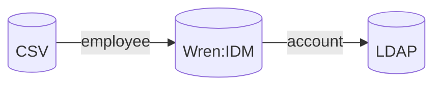
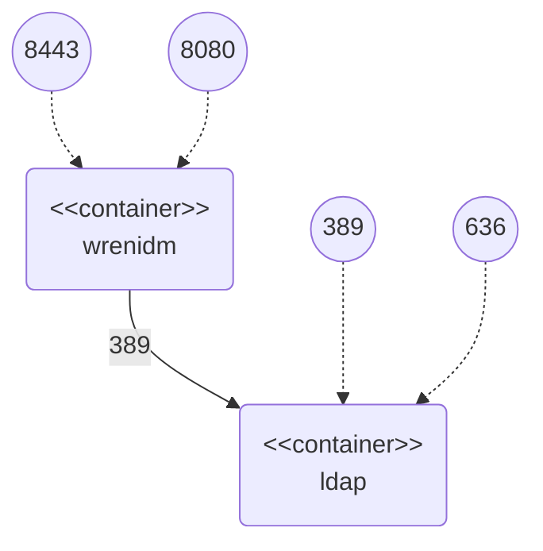

# Synchronization Sample

This sample demonstrates synchronization between integrated systems.
Sample contains following integrated systems:

  * CSV – CSV file with employee data representing source system
  * LDAP – OpenLDAP representing target system




## Configuration Files

Configuration files used in this sample can be found in `conf` folder:

  * `provisioner.openicf-csv.json` – configuration of CSV file connector
  * `provisioner.openicf-ldap.json` – configuration of LDAP connector
  * `sync.json` – mapping configuration:
    * `csvEmployee_managedUser` – mapping between CSV file and Wren:IDM
    * `managedUser_ldapAccount` – mapping between Wren:IDM and LDAP

Those files are mounted into the Wren:IDM container as bind mounts.
If you change them, Wren:IDM will notice and handle the change without restart.


## Docker Containers

The sample works with the following docker containers:

  * wrenidm – container with Wren:IDM installation
  * ldap – container with OpenLDAP system



All needed Docker containers can be started through following commands:

```bash
cd {GIT_REPOSITORIES}/wrenidm-cookbook/sync
docker-compose up -d
```


## Sample Procedure

### 1. Source System Reconciliation

Perform reconciliation of employees from the source CSV file using:

```bash
curl -k \
    -u openidm-admin:openidm-admin \
    -XPOST \
    "https://localhost:8443/openidm/recon?_action=recon&mapping=csvEmployee_managedUser"
```


### 2. Check Wren:IDM Managed Users

1. Go to admin user interface: `https://localhost:8443/admin`

2. Perform login using _openidm-admin_ as username and password

3. Navigate to user management: Manage -> User

4. Check managed users created in the Wren:IDM


### 3. Check LDAP Accounts

The default sample configuration has enabled implicit synchronization for LDAP account mapping.
This means that changes are propagated as soon as they happen in Wren:IDM without the need to trigger manual reconciliation.

1. Connect to the LDAP Docker container:

```bash
docker exec -it ldap bash
```

2. List existing LDAP accounts:

```bash
ldapsearch -H ldap://localhost -x -D "cn=admin,dc=wrensecurity,dc=org" -w admin -b "dc=wrensecurity,dc=org" "(objectClass=inetOrgPerson)"
```

3. Try LDAP bind using *Jon Snow* account:

```bash
ldapwhoami -H ldap://localhost -x -D "uid=snow123,dc=wrensecurity,dc=org" -w FooBar123
```


## Cleanup

When you finish all your tests, remove Docker containers using `docker-compose stop && docker-compose rm -f`.
