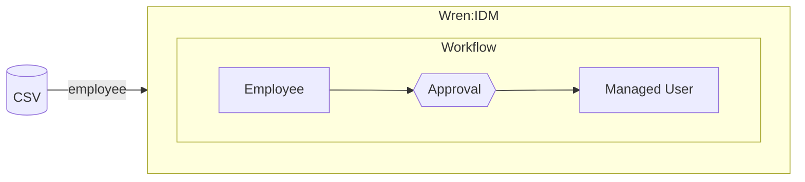
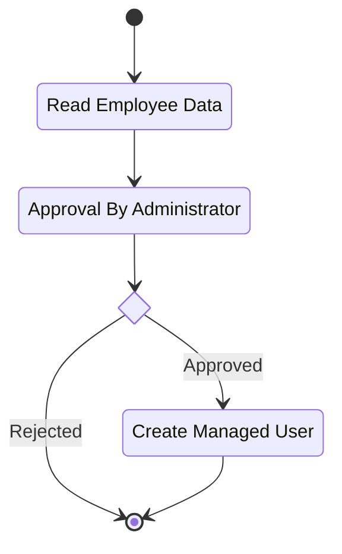
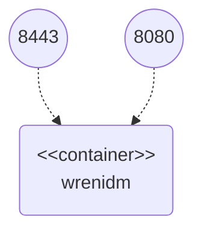

# Workflow Sample

This sample demonstrates approval of user provisioning (i.e. processing of workflow in Wren:IDM).
Creation of each managed user in Wren:IDM must be approved by administrator.
Users are synchronized from the source system (CSV file in this sample).




## Configuration Files

Configuration files used in this sample can be found in `conf` folder:

  * `provisioner.openicf-csv.json` – configuration of CSV file connector
  * `sync.json` – mapping configuration:
    * `csvEmployee_managedUser` – mapping between CSV file and Wren:IDM

Those files are mounted into the Wren:IDM container as bind mounts.
If you change them, Wren:IDM will notice and handle the change without restart.


## Workflow

Approval workflow consist of three tasks:

  * Read Employee Data – Read source data for current employee to be displayed in approval form
  * Approval By Administrator – User task to perform request approval / rejection
  * Create Managed User – Create managed user in Wren:IDM when request is approved




## Docker Containers

The sample works with the following docker containers:

  * wrenidm – container with Wren:IDM installation



All needed Docker containers can be started through following commands:

```bash
cd {GIT_REPOSITORIES}/wrenidm-cookbook/workflow
docker-compose up -d
```


## Sample Procedure


### 1. Create Approval Workflows

Perform reconciliation of employees from the source CSV file using:

```bash
curl -k \
  -u openidm-admin:openidm-admin \
  -XPOST \
  "https://localhost:8443/openidm/recon?_action=recon&mapping=csvEmployee_managedUser"
```

Reconciliation starts approval workflow for each user missing in Wren:IDM.


### 2. Approve / Reject Created Workflows

By default reconciliation creates approval workflows for three users (_Jon Snow_, _John Doe_, _Jane Doe_).
There are two options how to process created requests:

  * Self-Service UI – through form in self-service user interface
  * REST API – through HTTP request sent to the Wren:IDM REST API endpoint


#### 2.1 Self-Service UI

1. Go to user self-service interface: `https://localhost:8443/`

2. Perform login using _openidm-admin_ as username and password

3. You should see three approval tasks _User Approval_ in section _My Tasks_

4. Expand any approval task using _Details_ button

5. Perform decision (approve / reject) and complete the task (user will be created only when the request is approved)

6. Process all remaining tasks

7. Go to admin interface: `https://localhost:8443/admin`

8. Navigate to user management: Manage -> User

9. Check created managed users (only those you approved)


#### 2.2 REST API

1. List active approval tasks using:

    ```bash
    curl -k \
      -u openidm-admin:openidm-admin \
      "https://localhost:8443/openidm/workflow/taskinstance?_queryId=query-all-ids&_prettyPrint=true"
    ```

    Copy identifier of any approval task (attribute `_id`).

2. Approve approval task using:

    ```bash
    curl -k \
      -H "Content-type: application/json" \
      -u openidm-admin:openidm-admin \
      -XPOST --data '{"result":"approve"}' \
      "https://localhost:8443/openidm/workflow/taskinstance/{TASK_ID}?_action=complete"
    ```

    Approval task can be rejected using result value _reject_.

3. Check created user using:

    ```bash
    curl -k \
      -u openidm-admin:openidm-admin \
      "https://localhost:8443/openidm/managed/user?_queryFilter=true&_prettyPrint=true"
    ```


## Cleanup

When you finish all your tests, remove Docker containers using `docker-compose stop && docker-compose rm -f`.
